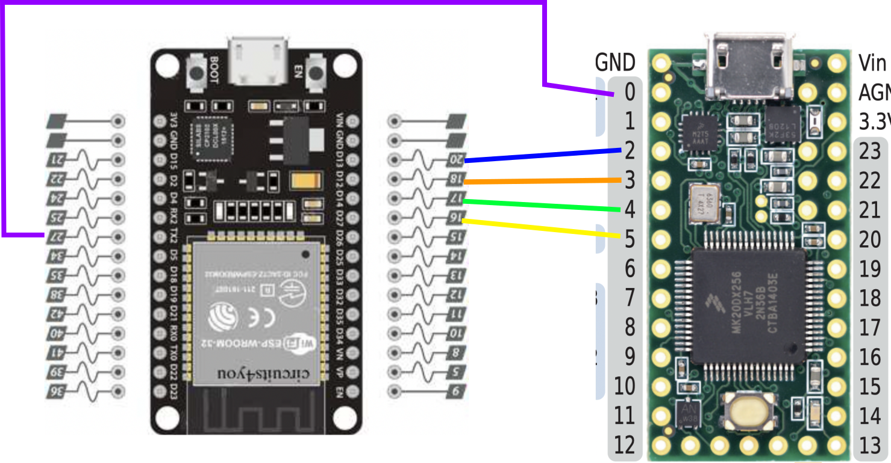
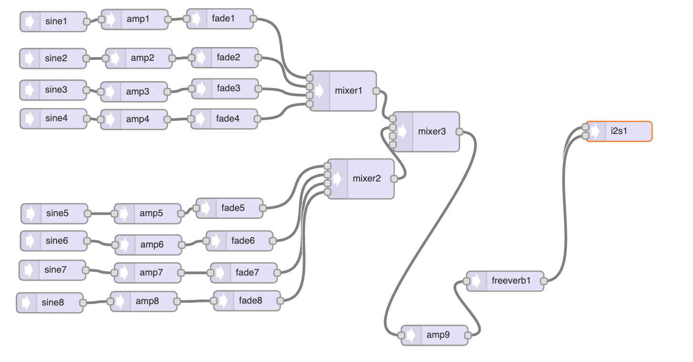
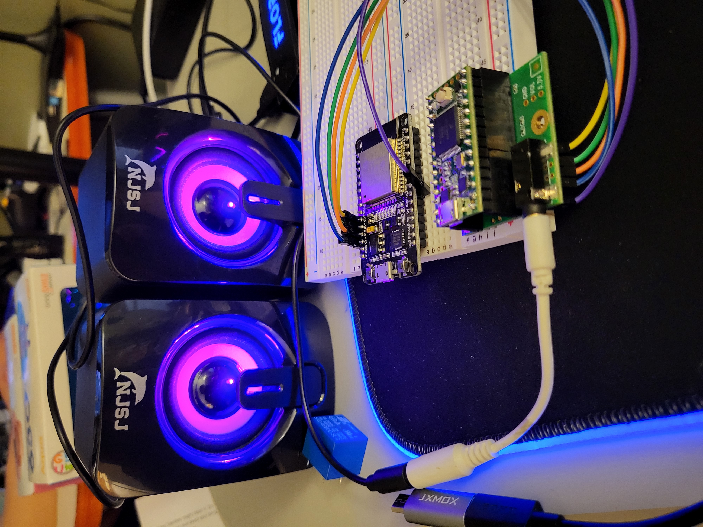
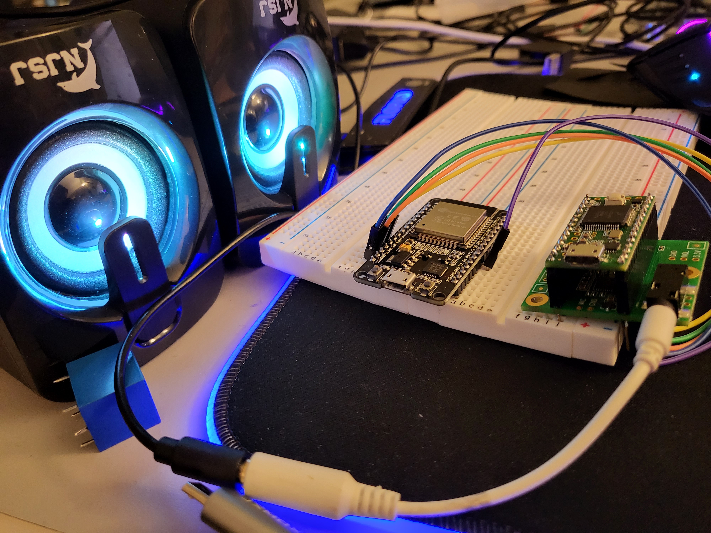
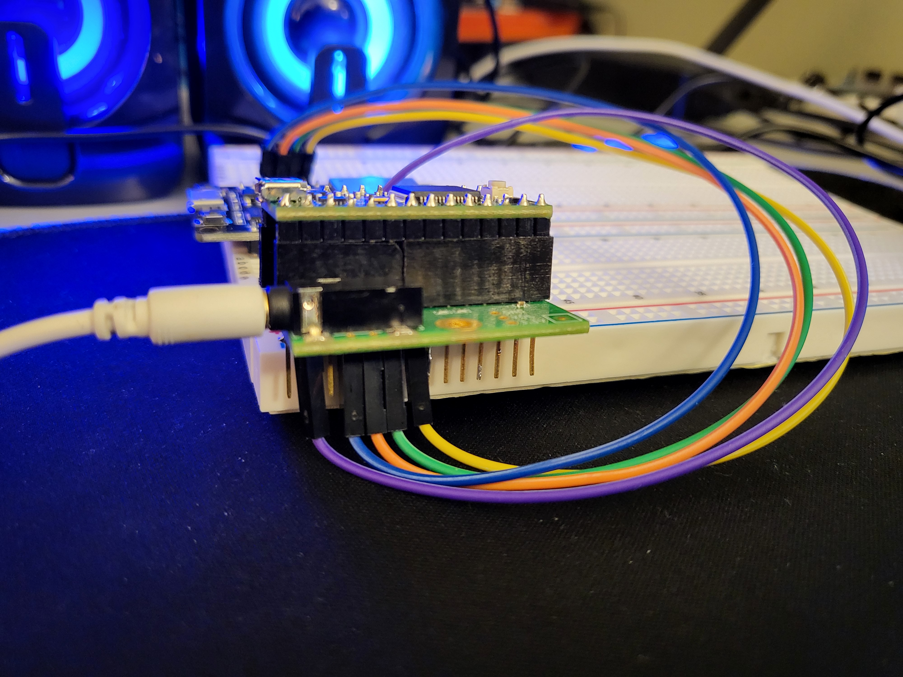
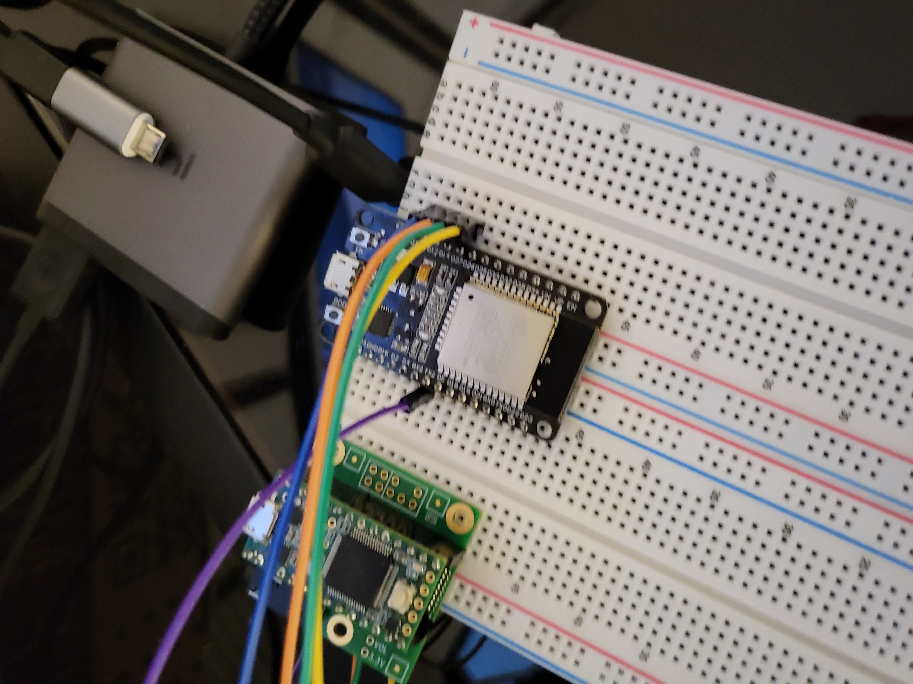
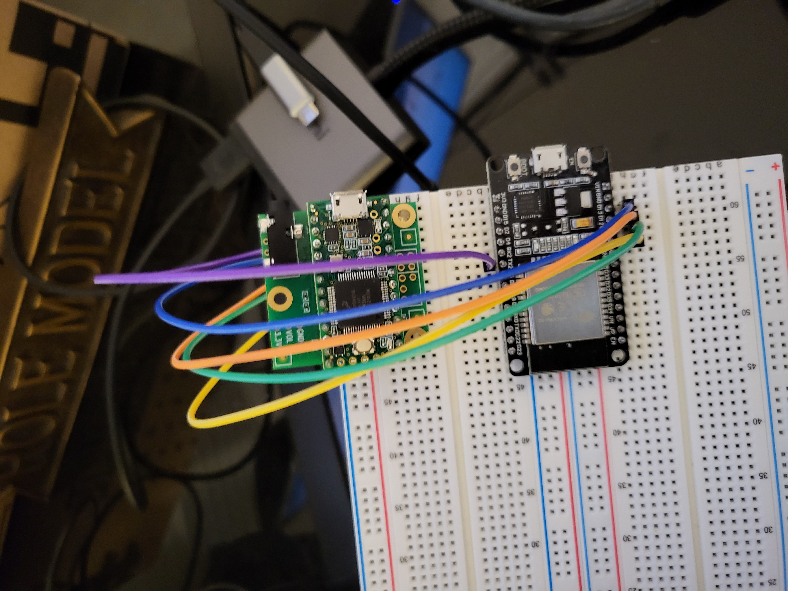
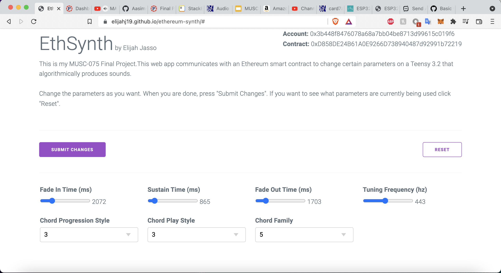
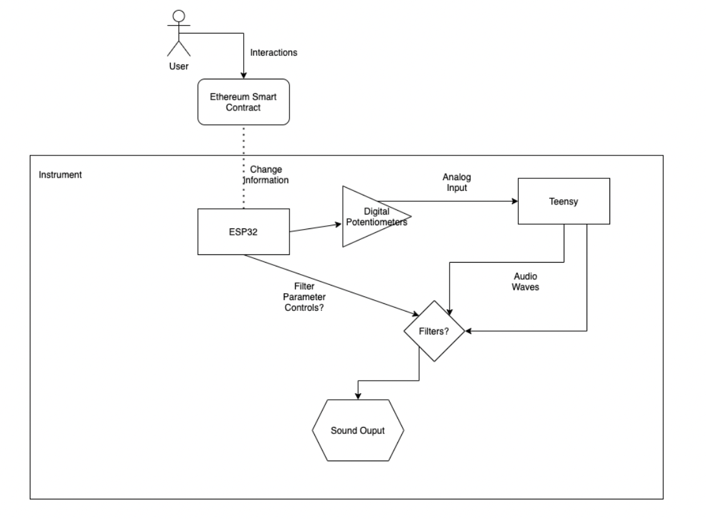

# EthSynth
## Important Links/Videos
### Videos
- [Setting up MetaMask](https://youtu.be/Jh3NbtJKF90)
- [Project Demo with Smart Contract](https://youtu.be/kTzi-2DIkKU)
- [Project Demo Song](https://youtu.be/KxMXWseGHQk)

### Other Links

 - [Web app](https://elijahj19.github.io/ethereum-synth/) for user interactions with smart contract

## Overview
### Artistic Intention
The inspiration for this project is to make a public decentralized collaborative instrument that can be interacted with from anywhere in the world via the use of Ethereum smart contracts (application hosted on the Ethereum blockchain). People will interact with a smart contract which will cause changes in the instrument’s music production. Ethereum smart contract interactions can take up to a few minutes to “confirm” so the instrument produces music continuously and smart contract interactions, once confirmed, will change certain parameters of the music being produced. Multiple people can be using the instrument at the same time.

The sounds produced by the instrument are continuously created and can be quite long as they fade in and out and have some variation even without input. 

The idea for the sound was inspired by Eirik Brandal’s Loihi sound sculpture, which has ethereal-sounding notes that slowly fade in and out. This pairs nicely with the idea of the Ethereum blockchain which itself is slow moving.

#### Why Ethereum
- Smart contracts are decentralized
-   No single point of failure, no need to place all your trust in one company
-   Smart contracts (and transactions) are secure and verifiable
-   Use decentralization and lot’s of cryptography to ensure that hacking is very hard
-   Anyone can verify for themselves exactly what happened on the network without having to trust someone else
-   Allows global access to financial services (among other ones) even in places where financial infrastructure is is lacking
-   More open and accessible to all!

### Extensions
There could be several ways to expand this project to a more official and polished art piece. I will list some ideas below

 - Collaborative Charity Fundraiser Art Piece - by charging users for interacting with the smart contract, one could easily raise money for an organization or cause. Users could give money while being able to take part in the art piece and sounds produced. Also, because the blockchain is very transparent, users could easily verify that their funds are actually going to the charity they want it to
 - 

### Changeable Parameters
The sounds produced are chords that are played with different parameters that can be changed via the smart contract:
 - Tuning Frequency (f0): from 390 to 470 hz
 - Chord Playstyles: notes played from left to right, notes played from right to left, notes played in random order, notes played left to right then right to left, and notes played all at once. 
 - Chord Progression Styles: randomly picked notes to start new chord, next half step (wrap around stepRange) to start new chord, next full step (wrap around stepRange) to start new chord, next note in current chord (wrap around stepRange) to start new chord, go up an octave (wrap around stepRange) to start new chord
 - Chord Family: major, minor, sus fourth, sus second, major seventh, minor seventh, dominant seventh, diminished seventh
 - Note fade in time: 1 to 10,000 ms
 - Note fade out time: 1 to 10,000 ms
 - Note sustain time: 1 to 10,000 ms

## Physical Parts
-   [**Teensy 3.2**](https://www.pjrc.com/store/teensy32.html)
Automatically generates sounds based on parameters and preprogrammed design
- [**Teensy Audio Adapter Borad**](https://www.pjrc.com/store/teensy3_audio.html) - Allows Teensy to communicate with speakers with audio 

- [**ESP32 Microcontroller**](https://www.amazon.com/gp/product/B079PVCF2G) 
Retrieves values from smart contract and relays parameter changes to Teensy
- **5 Jumper Cables**
Connecting the Teensy and ESP32
- **Cheap Speakers + Cable**
For playing sound from the Teensy via audio jack

## Diagrams
- ### Teensy + ESP32 Wiring

- ### Audio System Design Tool

## Components
### 4 Main Components
- **Teensy** - Produces sounds
--   Produces sounds using sine waves and some math    
--   Receives parameters changes from ESP32
--   ID for parameters communicated using input pull-ups encoded as a 4-bit binary number
--   Value for parameters communicated via Serial communication
-   **Smart Contract** - Manages the storing and changing of parameters
    
-   **ESP32 Microcontroller** - Retrieves data form smart contract and communicates it to Teensy
    

- **Web App** - Allows users/people/you to interact with smart contract to change parameters

## Images

### Early Design
